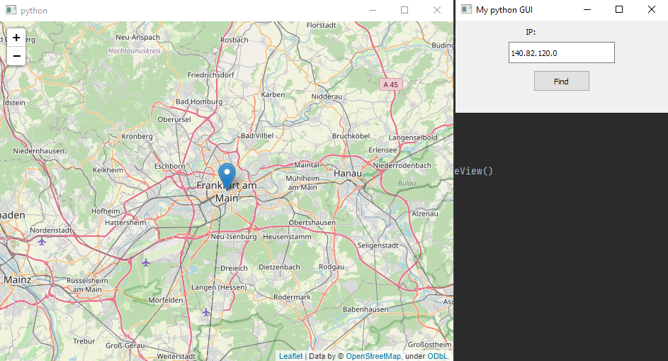

# python-find-location-by-ip

# Get started
* Install python 3.8 or higher

* Clone repo:   
`git clone https://github.com/Zendal-dev/python-find-location-by-ip.git`

* Install all dependencies:   
`pip install -r requirements.txt`

* Run script:   
`python main.py`
